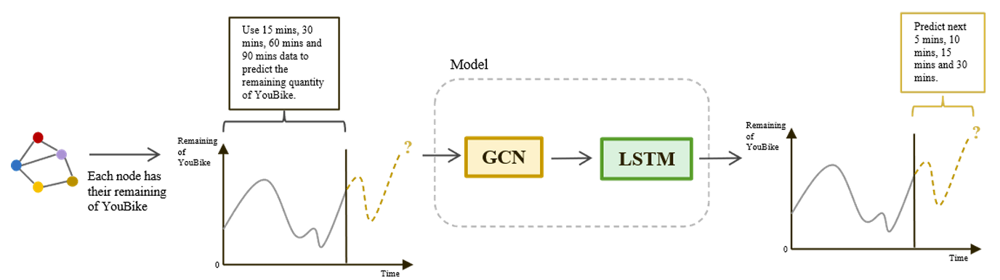

# Predicting YouBike Station Availability using GNN-LSTM Models
> 利用深度學習技術在 YouBike 借罄時點預測的研究
>
> This project was supported by Taiwan’s National Science and Technology Council (NSTC) undergraduate research program.

## Overview
This project predicts YouBike station availability using GNN and LSTM models.

## Project Goal
To predict YouBike station availability in real time and help users avoid arriving at empty stations.

## The workflow includes:
- Real-time data collection
- Time-series preprocessing
- Graph-structured modeling
- GNN-LSTM forecasting

## Model Architecture

## Tech Stack
- Python
- TensorFlow
- BeautifulSoup
- Pandas
- NumPy

## Features
- Automated real-time data collection
- Data preprocessing for time-series analysis
- Constructed graph-based spatial representations of YouBike stations for GNN modeling
- Deep learning forecasting framework
